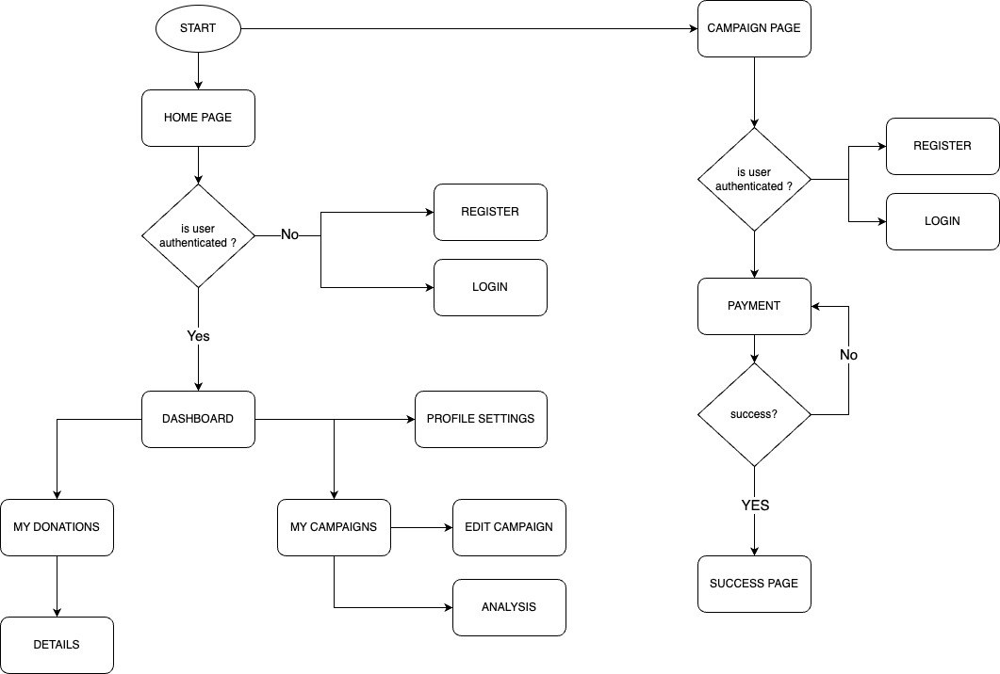

# Donation-Management-System

### User Flow Diagram

**Start:**

- This represents the initial entry point for the user. They might arrive at the homepage through various means, like direct URL access, clicking an ad, or following a link from social media.

**Home Page:**

- This is the landing page users see first. It should be clear and concise, highlighting the app's value proposition and key features.

- Registration:

   This button typically leads to a registration form where users create a new account. The form might ask for details like name, email address, password, and potentially optional information like location or interests.

  - **Variations:** Social media login integration can be offered, allowing users to register using existing accounts from platforms like Facebook or Google.

- **Login:** This button is for users who already have an account. Clicking it leads to the login page.

**Login Page:**

- This page should have clear fields for users to enter their registered email address and password.
  - **Additional Elements:** Options to "Forgot Password" or "Remember Me" can be included for user convenience. The "Forgot Password" flow would typically send a password reset link to the user's email.
- Decision Point - User Authentication:
  - **Success:** If the user enters the correct credentials, the system authenticates them and grants access to the application's core functionalities. This typically leads them to the user dashboard.
  - **Failure:** If the user enters incorrect information, an error message should be displayed. They can retry entering the correct credentials.
  - Variations:
    - Implement a maximum login attempt limit to prevent brute-force attacks.
    - Two-factor authentication can be offered for added security. This might involve sending a verification code to the user's phone after entering their password.

**Dashboard:**

- This is the central hub where users can manage their activities within the application.

  - **My Donations:** This section allows users to view a history of their donations, including details like amount donated, date, and recipient campaign.

  - My Campaigns:

     This section provides an overview of campaigns the user has created. Users can likely:

    - View a list of their campaigns.
    - Select a campaign to access its details and functionalities.
      - **Details & Analysis:**  This section might display information specific to the campaign, such as target goal, current progress, time remaining, and potentially data visualizations for backers and donations.
      - **Edit Campaign:** This allows users to modify details of their campaign, potentially including description, target goal, or end date.

  - **Profile Settings:** This section allows users to manage their account information, such as name, email address, and password. They might also be able to update their profile picture or bio.

**Payment:**

- This section is likely accessed during the campaign creation process or when making a donation to another user's campaign.
  - **Variations:** The application should integrate with a secure payment gateway to process user payments.
  - Decision Point - Payment Status:
    - **Success:** If the payment is successful, the user is directed to a confirmation page and the corresponding action is completed (donation processed or campaign created).
    - **Failure:** If the payment fails, the user should be informed with an error message and potentially given options to retry entering their payment information or choose a different payment method.

